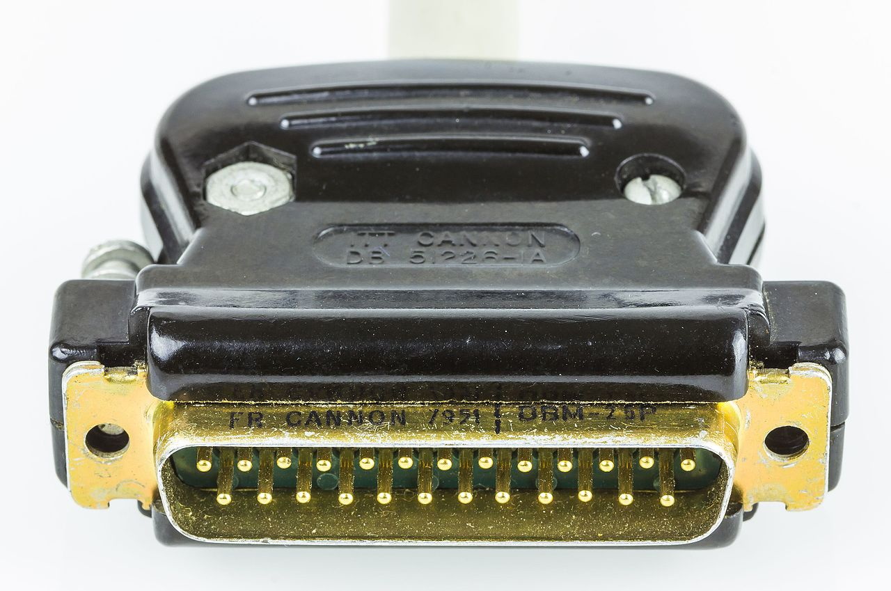
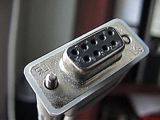
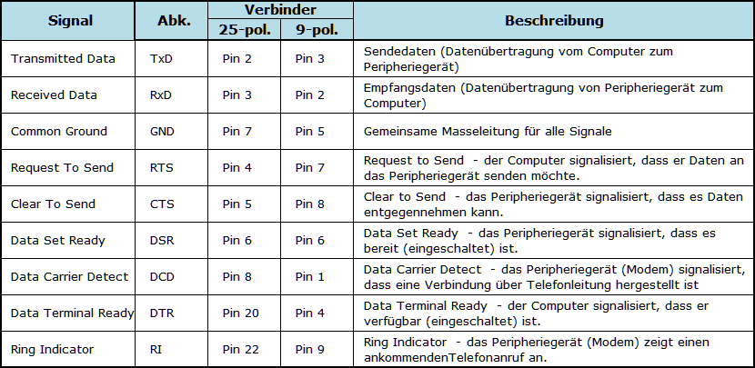
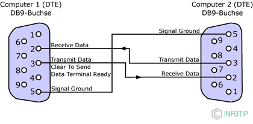
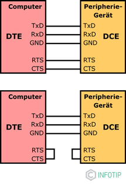
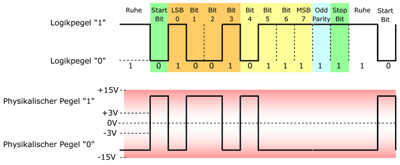

### Wozu 

* Serieller Datenaustausch
* p2p Verbindung
* asyncron 
* flankenerkennung mittels samples
* Wortweise übertragung 5-9 bits
* negative Logik

---

### Port

* 25 Pol Sub-D-Verbinder (2 Kanäle)
* EDV 9 Pol (1 Kanal)

---
### Geschichte
*RS* **-** *recomended standard* 
* 1990er 
* Mainframe Text-Terminal Verbindung
* Übertragung über Telefonleitung
* Immer weniger in verwendung.
---

---

---
### Flusssteuerung

* DTE > DTE Digital Handshake
* NUllmoduem Kabel 

  

---

### Uart Config

| Parameter | Values |   
|:---|:---|   
| boud | 9600|
| Bites | 8 |
| parity | none |
| stop Bit | 1 |  

---

### Signal Pegel 

* Pegelbereich +/- 3V und +/- 15V
* max Pegelhub 25V
* Üblich: +/- 5V; +/- 12; +/- 15V
* logic **1** = negativer pegel
* TTL Pegel benötigen wandler 

---

--- 

### quellen:
[1] https://kompendium.infotip.de/rs-232-die-serielle-schnittstelle.html
[2] https://de.wikipedia.org/wiki/RS-232
[3] https://www.st.com/en/evaluation-tools/nucleo-f103rb.html
